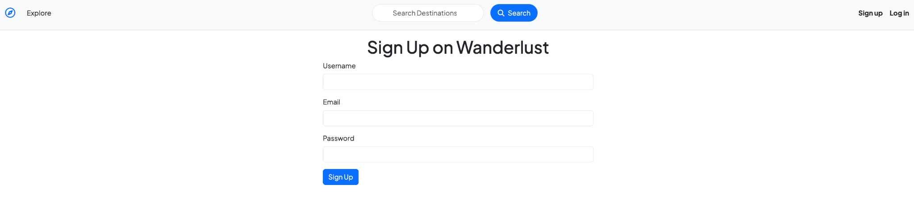
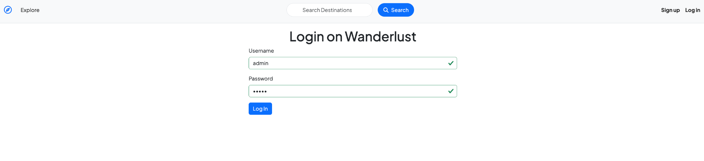
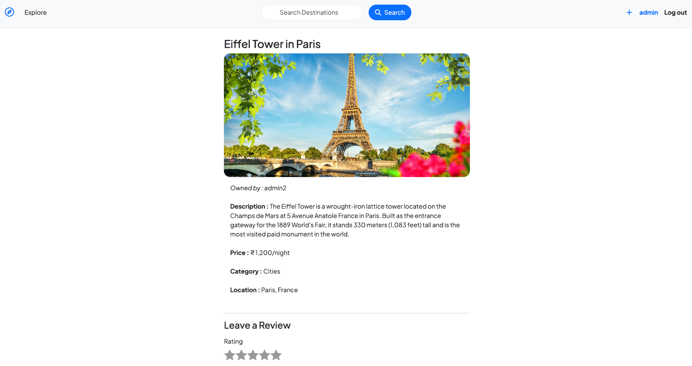
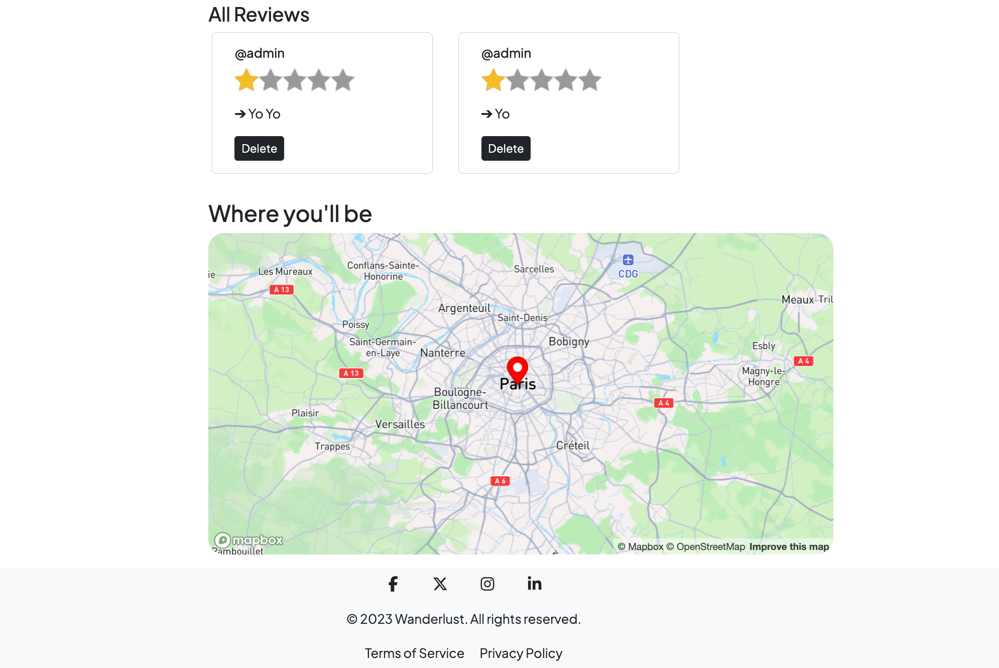
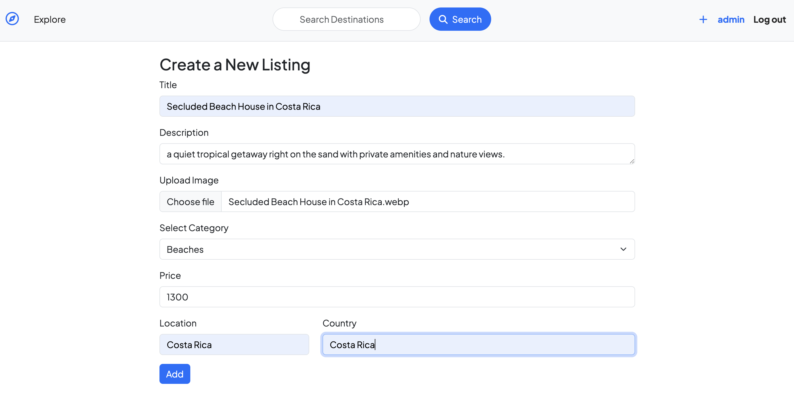
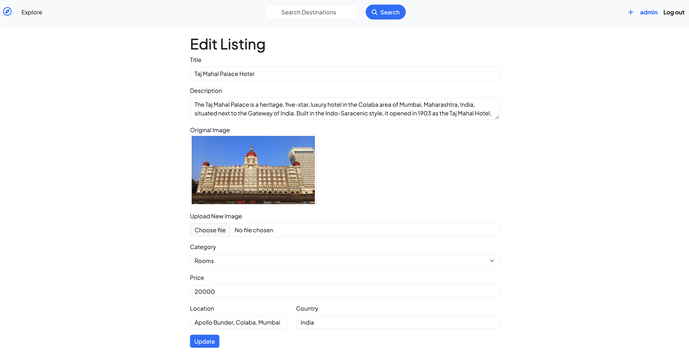
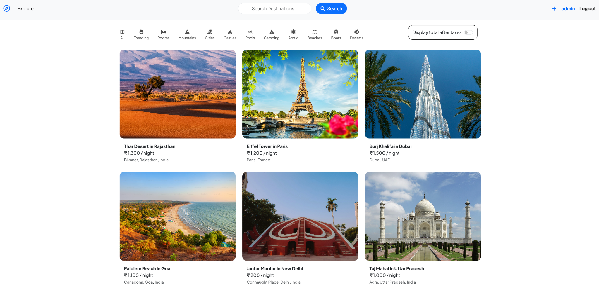

# 🌍 Wanderlust

A full-stack web application for exploring, creating, and managing travel and accommodation listings.

Wanderlust allows users to discover unique destinations, create their own listings, leave reviews, and explore locations on an interactive map.

---

## 🔗 Live Demo

🚀 Live Website: https://wanderlust-project-rgiu.onrender.com

💻 GitHub Repository: https://github.com/gauravkumar-codes/wanderlust-vacation-rental-website.git

---

## 📸 Screenshots

### 🏠 Explore Destinations

Browse various travel destinations with pricing, location details, categories, and search functionality.

<p align="center">
  
</p>

---

### ✨ User Signup

Users can create an account to access additional features and manage listings.

<p align="center">
  
</p>

---

### 🔐 User Login

Registered users can securely log in to their accounts.

<p align="center">
  
</p>

---

### 🏡 Listing Details

View complete information about a destination, including:

- Description
- Price per night
- Category
- Location
- Reviews

<p align="center">
  
</p>

---

### ⭐ Reviews and Location Map

Users can rate listings, leave reviews, and view the destination location on an interactive map.

<p align="center">
  
</p>

---

### ⭐ Creating new listing

Registered users can easily add new destinations to the existing listing.

<p align="center">
  
</p>

---

### ⭐ Editing new listing

Registered users can easily edit their already existing destinations in the listing.

<p align="center">
  
</p>

---

# 🚀 Features

## 🏠 Listings

- Browse travel and accommodation listings
- View detailed information about destinations
- Create new listings
- Edit existing listings
- Delete listings
- Add pricing and location information

## 🔎 Search and Categories

- Search destinations
- Browse listings by categories
- Explore different travel destinations

## 👤 User Authentication

- User signup
- User login and logout
- Secure authentication using Passport.js
- Session management

## ⭐ Reviews and Ratings

- Add reviews to listings
- Rate destinations
- View reviews from other users
- Delete reviews

## 🗺️ Location Features

- Interactive location map
- Display destination locations
- Location-based visualization

## 🔐 Authorization

- Only authenticated users can create listings
- Listing owners can edit and delete their listings
- Users can manage their own reviews

---

# 🛠️ Tech Stack

## Frontend

- HTML
- CSS
- JavaScript
- EJS

## Backend

- Node.js
- Express.js

## Database

- MongoDB
- Mongoose

## Authentication

- Passport.js
- Passport Local
- Passport Local Mongoose

## Additional Technologies

- Express Session
- Connect Flash
- Method Override
- Mapbox
- Bootstrap

---

# 📂 Project Structure

```text
Wanderlust/
│
├── controllers/
│   ├── listings.js
│   ├── reviews.js
│   └── users.js
│
├── models/
│   ├── listing.js
│   ├── review.js
│   └── user.js
│
├── routes/
│   ├── listings.js
│   ├── reviews.js
│   └── users.js
│
├── views/
│   ├── includes/
│   ├── layouts/
│   ├── listings/
│   └── users/
│
├── public/
│   ├── css/
│   └── js/
│
├── screenshots/
│   ├── home.png
│   ├── signup.png
│   ├── login.png
│   ├── listing-details.png
│   └── reviews-map.png
│
├── app.js
├── middleware.js
├── schema.js
├── package.json
└── README.md
```

## ⚙️ Installation and Setup

### 1️⃣ Clone the Repository

```bash
git clone https://github.com/gauravkumar-codes/wanderlust-vacation-rental-website.git
```

### 2️⃣ Navigate to the Project Directory

```bash
cd Wanderlust
```

### 3️⃣ Install Dependencies

```bash
npm install
```

### 4️⃣ Configure Environment Variables

Create a `.env` file in the root directory.

Example:

```env
ATLASDB_URL=your_mongodb_connection_string
SECRET=your_session_secret
MAP_TOKEN=your_mapbox_access_token
```

Make sure `.env` is included in your `.gitignore`.

### 5️⃣ Start the Application

```bash
node app.js
```

Or, if you use Nodemon:

```bash
nodemon app.js
```

### 6️⃣ Open the Application

Visit:

```text
http://localhost:8080
```

## 🔄 Application Workflow
```
User
  │
  ▼
Signup / Login
  │
  ▼
Explore Listings
  │
  ├──────────────► Search Destinations
  │
  ├──────────────► View Listing Details
  │
  └──────────────► View Location on Map
                         │
                         ▼
                    Add Review
                         │
                         ▼
                  Manage Listings
                  (Authorized Users)
```

## 🔐 Authentication and Authorization

```
Wanderlust uses Passport.js for authentication.

The application provides:

• User registration
• Secure login
• Session management
• Logout functionality
• Protected routes

Authorization ensures that:

• Only logged-in users can create listings.
• Only listing owners can edit or delete their listings.
• Users can manage their own reviews.
```

## 📚 Key Concepts Implemented

```
This project helped in understanding and implementing:

• Full-Stack Web Development
• RESTful Routing
• MVC Architecture
• CRUD Operations
• Authentication
• Authorization
• Session Management
• MongoDB Database Integration
• Mongoose ODM
• Express Middleware
• Error Handling
• Server-Side Rendering using EJS
• Interactive Maps
• Form Validation
```

## 🎯 Future Improvements

```
Some features that can be added in the future:

• 🔍 Advanced search and filtering
• 📍 Location-based recommendations
• 🖼️ Image upload functionality using Cloudinary
• ❤️ Save favorite listings
• 👤 User profile pages
• 📱 Improved mobile responsiveness
• 💳 Online booking system
• 💬 Real-time messaging
• 📊 Admin dashboard
```

## 🧑‍💻 Learning Outcomes

```
Through this project, I gained hands-on experience with:

• Building a complete full-stack web application
• Designing RESTful APIs and routes
• Connecting applications with MongoDB
• Implementing authentication and authorization
• Managing user sessions
• Creating dynamic pages using EJS
• Performing CRUD operations
• Integrating interactive maps
• Structuring applications using MVC architecture
```

## 👨‍💻 Author

```
Gaurav Kumar

B.Tech Information Technology Student
```

## ⭐ Show Your Support

```
If you found this project interesting, consider giving it a ⭐ on GitHub!
```

## © 2026 Wanderlust

```
Built with ❤️ using Node.js, Express.js, MongoDB, and EJS.
```# 🌍 Wanderlust

A full-stack web application for exploring, creating, and managing travel and accommodation listings.

Wanderlust allows users to discover unique destinations, create their own listings, leave reviews, and explore locations on an interactive map.

---

## 🔗 Live Demo

🚀 Live Website: https://wanderlust-project-rgiu.onrender.com

💻 GitHub Repository: https://github.com/gauravkumar-codes/wanderlust-vacation-rental-website.git

---

## 📸 Screenshots

### 🏠 Explore Destinations

Browse various travel destinations with pricing, location details, categories, and search functionality.

<p align="center">
  
</p>

---

### ✨ User Signup

Users can create an account to access additional features and manage listings.

<p align="center">
  
</p>

---

### 🔐 User Login

Registered users can securely log in to their accounts.

<p align="center">
  
</p>

---

### 🏡 Listing Details

View complete information about a destination, including:

- Description
- Price per night
- Category
- Location
- Reviews

<p align="center">
  
</p>

---

### ⭐ Reviews and Location Map

Users can rate listings, leave reviews, and view the destination location on an interactive map.

<p align="center">
  
</p>

---

### ⭐ Creating new listing

Registered users can easily add new destinations to the existing listing.

<p align="center">
  
</p>

---

### ⭐ Editing new listing

Registered users can easily edit their already existing destinations in the listing.

<p align="center">
  
</p>

---

# 🚀 Features

## 🏠 Listings

- Browse travel and accommodation listings
- View detailed information about destinations
- Create new listings
- Edit existing listings
- Delete listings
- Add pricing and location information

## 🔎 Search and Categories

- Search destinations
- Browse listings by categories
- Explore different travel destinations

## 👤 User Authentication

- User signup
- User login and logout
- Secure authentication using Passport.js
- Session management

## ⭐ Reviews and Ratings

- Add reviews to listings
- Rate destinations
- View reviews from other users
- Delete reviews

## 🗺️ Location Features

- Interactive location map
- Display destination locations
- Location-based visualization

## 🔐 Authorization

- Only authenticated users can create listings
- Listing owners can edit and delete their listings
- Users can manage their own reviews

---

# 🛠️ Tech Stack

## Frontend

- HTML
- CSS
- JavaScript
- EJS

## Backend

- Node.js
- Express.js

## Database

- MongoDB
- Mongoose

## Authentication

- Passport.js
- Passport Local
- Passport Local Mongoose

## Additional Technologies

- Express Session
- Connect Flash
- Method Override
- Mapbox
- Bootstrap

---

# 📂 Project Structure

```text
Wanderlust/
│
├── controllers/
│   ├── listings.js
│   ├── reviews.js
│   └── users.js
│
├── models/
│   ├── listing.js
│   ├── review.js
│   └── user.js
│
├── routes/
│   ├── listings.js
│   ├── reviews.js
│   └── users.js
│
├── views/
│   ├── includes/
│   ├── layouts/
│   ├── listings/
│   └── users/
│
├── public/
│   ├── css/
│   └── js/
│
├── screenshots/
│   ├── home.png
│   ├── signup.png
│   ├── login.png
│   ├── listing-details.png
│   └── reviews-map.png
│
├── app.js
├── middleware.js
├── schema.js
├── package.json
└── README.md
```

## ⚙️ Installation and Setup

### 1️⃣ Clone the Repository

```bash
git clone https://github.com/gauravkumar-codes/wanderlust-vacation-rental-website.git
```

### 2️⃣ Navigate to the Project Directory

```bash
cd Wanderlust
```

### 3️⃣ Install Dependencies

```bash
npm install
```

### 4️⃣ Configure Environment Variables

Create a `.env` file in the root directory.

Example:

```env
ATLASDB_URL=your_mongodb_connection_string
SECRET=your_session_secret
MAP_TOKEN=your_mapbox_access_token
```

Make sure `.env` is included in your `.gitignore`.

### 5️⃣ Start the Application

```bash
node app.js
```

Or, if you use Nodemon:

```bash
nodemon app.js
```

### 6️⃣ Open the Application

Visit:

```text
http://localhost:8080
```

## 🔄 Application Workflow
```
User
  │
  ▼
Signup / Login
  │
  ▼
Explore Listings
  │
  ├──────────────► Search Destinations
  │
  ├──────────────► View Listing Details
  │
  └──────────────► View Location on Map
                         │
                         ▼
                    Add Review
                         │
                         ▼
                  Manage Listings
                  (Authorized Users)
```

## 🔐 Authentication and Authorization

```
Wanderlust uses Passport.js for authentication.

The application provides:

• User registration
• Secure login
• Session management
• Logout functionality
• Protected routes

Authorization ensures that:

• Only logged-in users can create listings.
• Only listing owners can edit or delete their listings.
• Users can manage their own reviews.
```

## 📚 Key Concepts Implemented

```
This project helped in understanding and implementing:

• Full-Stack Web Development
• RESTful Routing
• MVC Architecture
• CRUD Operations
• Authentication
• Authorization
• Session Management
• MongoDB Database Integration
• Mongoose ODM
• Express Middleware
• Error Handling
• Server-Side Rendering using EJS
• Interactive Maps
• Form Validation
```

## 🎯 Future Improvements

```
Some features that can be added in the future:

• 🔍 Advanced search and filtering
• 📍 Location-based recommendations
• 🖼️ Image upload functionality using Cloudinary
• ❤️ Save favorite listings
• 👤 User profile pages
• 📱 Improved mobile responsiveness
• 💳 Online booking system
• 💬 Real-time messaging
• 📊 Admin dashboard
```

## 🧑‍💻 Learning Outcomes

```
Through this project, I gained hands-on experience with:

• Building a complete full-stack web application
• Designing RESTful APIs and routes
• Connecting applications with MongoDB
• Implementing authentication and authorization
• Managing user sessions
• Creating dynamic pages using EJS
• Performing CRUD operations
• Integrating interactive maps
• Structuring applications using MVC architecture
```

## 👨‍💻 Author

```
Gaurav Kumar

B.Tech Information Technology Student
```

## ⭐ Show Your Support

```
If you found this project interesting, consider giving it a ⭐ on GitHub!
```

## © 2026 Wanderlust

```
Built with ❤️ using Node.js, Express.js, MongoDB, and EJS.
```
